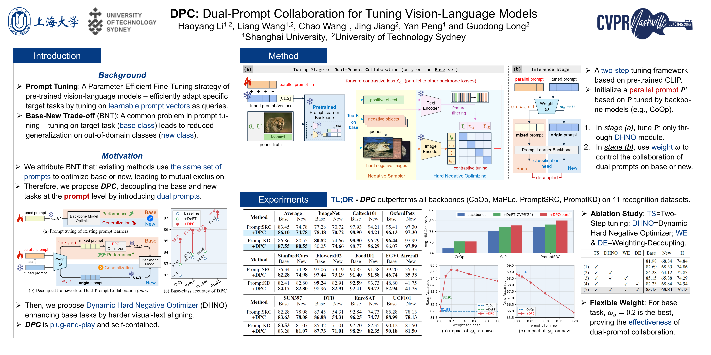

# DPC: Dual-Prompt Collaboration for Tuning Vision-Language Models 


> **[CVPR 2025] DPC: Dual-Prompt Collaboration for Tuning Vision-Language Models** <br>
> Haoyang Li, Liang Wang, Chao Wang, Jing Jiang, Yan Peng and Guodong Long. <br>
> Shanghai University, University of Technology Sydney <br>

Arxiv Link: [https://arxiv.org/abs/2503.13443](https://arxiv.org/abs/2503.13443)

<hr />

### 🔥 News

- **NOTE**: We are preparing our code repository (mainly rewriting comments to improve readability). We hope to release code in April.

- (18 Mar. 2025) Our paper is published on [Arxiv](https://arxiv.org/abs/2503.13443).

- (28 Feb. 2025) Our paper is accepted by CVPR 2025!


<hr />

### Abstract

> The **Base-New Trade-off** (BNT) problem universally exists during the optimization of **CLIP-based prompt tuning**, where continuous fine-tuning on base (target) classes leads to a simultaneous decrease of generalization ability on new (unseen) classes. Existing approaches attempt to regulate the prompt tuning process to balance BNT by appending constraints. However, imposed on the same target prompt, these constraints fail to fully avert the mutual exclusivity between the optimization directions for base and new. <br>
> As a novel solution to this challenge, we propose the plug-and-play **D**ual-**P**rompt **C**ollaboration (DPC) framework, the first that decoupling the optimization processes of base and new tasks at the **prompt** level. <br>
> Specifically, we clone a learnable parallel prompt based on the backbone prompt, and introduce a variable Weighting-Decoupling framework to independently control the optimization directions of dual prompts specific to base or new tasks, thus avoiding the conflict in generalization. Meanwhile, we propose a Dynamic Hard Negative Optimizer, utilizing dual prompts to construct a more challenging optimization task on base classes for enhancement. Extensive experiments on multiple backbones demonstrate that DPC can significantly improve base performance without introducing any external knowledge beyond the base classes, while maintaining generalization to new classes.

### Framework

<div style="text-align:center"></div>

<figcaption class="content has-text-left"  style="word-break:normal">Figure 1. Overview of our proposed <strong>DPC</strong>. In <strong>(a)</strong> fine-tuning stage, DPC initializes parallel prompt P′ based on tuned prompt P obtained by fine-tuning backbone. Negative Sampler applies tuned prompt P as query to sample hard negatives, then feed them into Dynamic Hard Negative Optimizer to enhance base tasks. In <strong>(b)</strong> inference stage, DPC decouples base and new tasks by independent weight accumulation on dual prompts.</figcaption>

### Main Contributions

(1) To the best of our knowledge, DPC is the first prompt tuning enhancement strategy that decouples at the **prompt** level to overcome the BNT problem. 

(2) We design a novel **Dynamic Hard Negative Optimizer**, significantly enhancing the base-class performance of DPC by establishing harder visual-text aligning tasks using dual prompts, achieving new State-Of-The-Art.

(3) We introduce **plug-and-play** and self-contained features to the model, endowing it with outstanding adaptability and transferability while minimizing requirements of external knowledge.

## Experimental Results
### Base-to-New
Results reported below show accuracy for base and new classes on 11 recognition-based datasets. For all 4 backbone models, DPC achieves general base-class performance improvements while fully retaining new class generalization.

<figure>

</figure>

### Plug-and-Play
For plug-and-play characteristic, we compare DPC with [DePT](https://github.com/Koorye/DePT) (decouples base and new tasks at the **feature** level). Results indicate that decoupling at the **prompt** level is more thorough, furnishing a broader optimization space for the plug-and-play model.

<div align="center">
	
</div>               

## Running

### Preliminary

(**Acknowledgement**: This part is modified from [PromptKD](https://github.com/zhengli97/PromptKD/tree/main)'s official repository.)

1. Create the environment and install Dassl.pytorch library. Please follow the instructions detailed in [INSTALL.md](https://github.com/JREion/DPC/blob/main/docs/INSTALL.md). 
2. Download publicly released pre-trained teacher ViT-L/14 CLIP models of PromptKD.<br>
   Files are publicly available at [[Baidu Yun](https://pan.baidu.com/s/1KNJ1mhNKoxdSli4ZldeZUg?pwd=mjf4)] [[TeraBox](https://terabox.com/s/1X4mxJtSaR8W2lrK5bsrCkg)] [[Google Drive](https://drive.google.com/drive/folders/1OdQ9WauZmYAzVSUTTw7tIKKChyECIS5B?usp=sharing)]<br>
   (Note that due to cloud space limitations, we only provide a limited number of models in Google Cloud. Sorry.)<br>
   After obtaining the teacher model, unzip these files and place the model in the `./teacher_model` folder.
3. Download the original ViT-B/16 and ViT-L/14 CLIP model weights from the official OpenAI website. Then place these models in the `./clip` folder.<br>
   [[ViT-B/16 CLIP](https://openaipublic.azureedge.net/clip/models/5806e77cd80f8b59890b7e101eabd078d9fb84e6937f9e85e4ecb61988df416f/ViT-B-16.pt)] [[ViT-L/14 CLIP](https://openaipublic.azureedge.net/clip/models/b8cca3fd41ae0c99ba7e8951adf17d267cdb84cd88be6f7c2e0eca1737a03836/ViT-L-14.pt)]
4. Download the zip file of DPC-specific annotation files: [[Google Drive](https://drive.google.com/file/d/1kMManryXLEYB6rMoeBwHiDzgmE4X_Lbz/view?usp=sharing)] [[Baidu Yun](https://pan.baidu.com/s/1LKU0g7H9o14GnZ0aZ-QMuw?pwd=cvpr)]<br>
   Then unzip and place these `SPLE_XXX.json` files in the `./DATA/SPLE_Database` folder.
5. Prepare the dataset. Please follow the instructions detailed in [DATASETS.md](https://github.com/JREion/DPC/blob/main/docs/DATASETS.md).

### Fine-tuning Process

Since DPC is a plug-and-play model, DPC first uses the **original backbone model** (e.g., CoOp, PromptKD, ...) for the first stage of fine-tuning to get the tuned prompt. Then, in the second stage, fine-tuning based on the **DPC**-related trainer is performed to introduce and tune parallel prompt. 

We will release scripts to automate this process in the future.

Below, we take the base-to-new fine-tuning task of the DPC+PromptKD model on the StanfordCars dataset as an example (epoch=20, weight_for_base=0.2; weight_for_new=0.0):

1. Execute fine-tuning on PromptKD backbone to get tuned prompt (and other activated parameters):

   ```
   python train.py  --root DATA/stanford_cars --seed 1 --trainer PromptKD --dataset-config-file configs/datasets/stanford_cars.yaml --config-file configs/trainers/PromptKD/vit_b16_c2_ep20_batch32_4+4ctx.yaml --output-dir output/PromptKD/base2new/train_base/stanford_cars/1_PromptKD_baseline/vit_b16_c2_ep20_batch32_4+4ctx/seed1 DATASET.NUM_SHOTS 0  TRAINER.MODAL base2novel TRAINER.PROMPTKD.TEMPERATURE 1.0 TRAINER.PROMPTKD.KD_WEIGHT 1000.0 TEST.SPLIT val
   ```

2. Based on the PromptKD backbone, continue to fine-tune by **DPC** on base classes:

   ```
   python train.py  --root DATA/stanford_cars --seed 1 --trainer StackSPLE_PromptKD --dataset-config-file configs/datasets/stanford_cars.yaml --config-file configs/trainers/SPLE/PromptKD/vit_b16_c2_ep20_batch4_4+4ctx.yaml --output-dir output/PromptKD/base2new/train_base/stanford_cars/3_SPLE_converse/vit_b16_c2_ep20_batch4_4+4ctx_con20/seed1 DATASET.NUM_SHOTS 16 SPLE.BACK_CKPT_PATH output/PromptKD/base2new/train_base/stanford_cars/1_PromptKD_baseline/vit_b16_c2_ep20_batch32_4+4ctx/seed1 SPLE.BACK_CKPT_EPOCH 20 SPLE.PIC_LIB DATA/SPLE_database/SPLE_StanfordCars.json SPLE.STACK.MODE converse SPLE.STACK.WEIGHT 0.2 DATASET.SUBSAMPLE_CLASSES base SPLE.STACK.WEIGHT_FOR_NEW 0.0 TRAINER.MODAL base2novel TRAINER.PROMPTKD.TEMPERATURE 1.0 TRAINER.PROMPTKD.KD_WEIGHT 1000.0 TEST.SPLIT val
   ```

3. Test the new-class generalization of **DPC**:

   ```
   python train.py  --root DATA/stanford_cars --seed 1 --trainer StackSPLE_PromptKD --dataset-config-file configs/datasets/stanford_cars.yaml --config-file configs/trainers/SPLE/PromptKD/vit_b16_c2_ep20_batch4_4+4ctx.yaml --output-dir output/PromptKD/base2new/train_base/stanford_cars/3_SPLE_converse/vit_b16_c2_ep20_batch4_4+4ctx_con20/seed1 DATASET.NUM_SHOTS 16 SPLE.BACK_CKPT_PATH output/PromptKD/base2new/train_base/stanford_cars/1_PromptKD_baseline/vit_b16_c2_ep20_batch32_4+4ctx/seed1 SPLE.BACK_CKPT_EPOCH 20 SPLE.PIC_LIB DATA/SPLE_database/SPLE_StanfordCars.json SPLE.STACK.MODE converse SPLE.STACK.WEIGHT 0.2 DATASET.SUBSAMPLE_CLASSES new SPLE.STACK.WEIGHT_FOR_NEW 0.0 TRAINER.MODAL base2novel TRAINER.PROMPTKD.TEMPERATURE 1.0 TRAINER.PROMPTKD.KD_WEIGHT 1000.0 TEST.SPLIT test
   ```


## Contact

If you have any questions about our DPC model, you can submit an issue on GitHub or contact me by email (haoyang.li-3@student.uts.edu.au).

## Poster
<div style="text-align:center"></div>

## Citation

If you find our paper or repo helpful for your research, please consider citing our paper and giving this repo a star⭐. Thank you!

```
@article{li2025dpc,
  title={DPC: Dual-Prompt Collaboration for Tuning Vision-Language Models},
  author={Li, Haoyang and Wang, Liang and Wang, Chao and Jiang, Jing and Peng, Yan and Long, Guodong},
  journal={arXiv preprint arXiv:2503.13443},
  year={2025}
}
```

## Acknowledgements

Our code is based on [PromptKD](https://github.com/zhengli97/PromptKD), [DePT](https://github.com/Koorye/DePT), [PromptSRC](https://github.com/muzairkhattak/PromptSRC), [MaPLe](https://github.com/muzairkhattak/multimodal-prompt-learning) and [CoOp](https://github.com/KaiyangZhou/CoOp) repository. We thank the authors for releasing their code.
