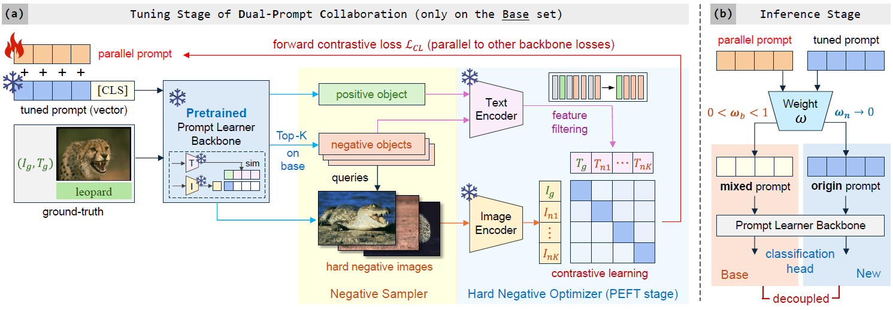
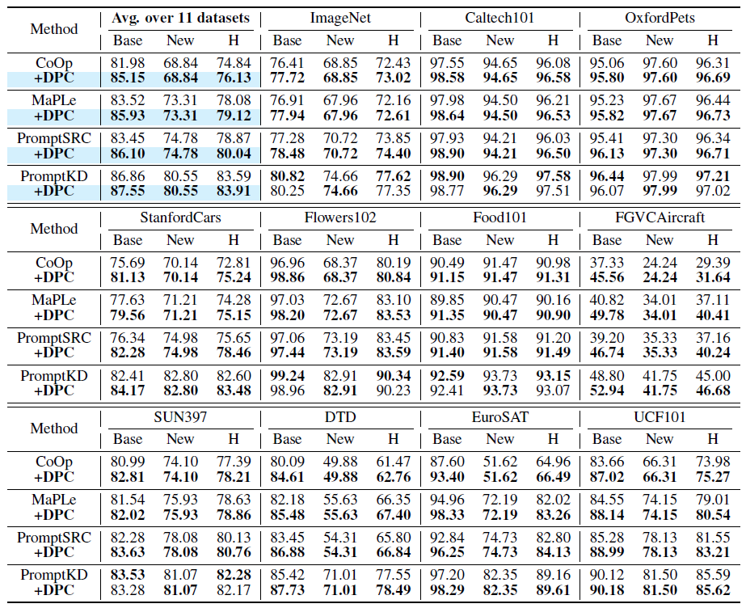
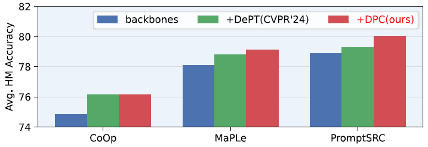

# DPC: Dual-Prompt Collaboration for Tuning Vision-Language Models 


> **[CVPR 2025] DPC: Dual-Prompt Collaboration for Tuning Vision-Language Models** <br>
> Haoyang Li, Liang Wang, Chao Wang, Jing Jiang, Yan Peng and Guodong Long. <br>
> Shanghai University, University of Technology Sydney <br>

Arxiv Link: [https://arxiv.org/abs/2503.13443](https://arxiv.org/abs/2503.13443)

<hr />

### 🔥 News

- **NOTE**: We are preparing our code repository (mainly rewriting comments to improve readability). We hope to release code in April.

- (18 Mar. 2025) Our paper is published on [Arxiv](https://arxiv.org/abs/2503.13443).

- (28 Feb. 2025) Our paper is accepted by CVPR 2025!


<hr />

### Abstract

> The **Base-New Trade-off** (BNT) problem universally exists during the optimization of **CLIP-based prompt tuning**, where continuous fine-tuning on base (target) classes leads to a simultaneous decrease of generalization ability on new (unseen) classes. Existing approaches attempt to regulate the prompt tuning process to balance BNT by appending constraints. However, imposed on the same target prompt, these constraints fail to fully avert the mutual exclusivity between the optimization directions for base and new. <br>
> As a novel solution to this challenge, we propose the plug-and-play **D**ual-**P**rompt **C**ollaboration (DPC) framework, the first that decoupling the optimization processes of base and new tasks at the **prompt** level. <br>
> Specifically, we clone a learnable parallel prompt based on the backbone prompt, and introduce a variable Weighting-Decoupling framework to independently control the optimization directions of dual prompts specific to base or new tasks, thus avoiding the conflict in generalization. Meanwhile, we propose a Dynamic Hard Negative Optimizer, utilizing dual prompts to construct a more challenging optimization task on base classes for enhancement. Extensive experiments on multiple backbones demonstrate that DPC can significantly improve base performance without introducing any external knowledge beyond the base classes, while maintaining generalization to new classes.

### Framework

<div style="text-align:center"></div>

<figcaption class="content has-text-left"  style="word-break:normal">Figure 1. Overview of our proposed <strong>DPC</strong>. In <strong>(a)</strong> fine-tuning stage, DPC initializes parallel prompt P′ based on tuned prompt P obtained by fine-tuning backbone. Negative Sampler applies tuned prompt P as query to sample hard negatives, then feed them into Dynamic Hard Negative Optimizer to enhance base tasks. In <strong>(b)</strong> inference stage, DPC decouples base and new tasks by independent weight accumulation on dual prompts.</figcaption>

### Main Contributions

(1) To the best of our knowledge, DPC is the first prompt tuning enhancement strategy that decouples at the **prompt** level to overcome the BNT problem. 

(2) We design a novel **Dynamic Hard Negative Optimizer**, significantly enhancing the base-class performance of DPC by establishing harder visual-text aligning tasks using dual prompts, achieving new State-Of-The-Art.

(3) We introduce **plug-and-play** and self-contained features to the model, endowing it with outstanding adaptability and transferability while minimizing requirements of external knowledge.

## Experimental Results
### Base-to-New
Results reported below show accuracy for base and new classes on 11 recognition-based datasets. For all 4 backbone models, DPC achieves general base-class performance improvements while fully retaining new class generalization.

<figure>

</figure>

### Plug-and-Play
For plug-and-play characteristic, we compare DPC with [DePT](https://github.com/Koorye/DePT) (decouples base and new tasks at the **feature** level). Results indicate that decoupling at the **prompt** level is more thorough, furnishing a broader optimization space for the plug-and-play model.

<div align="center">
	
</div>               

## Running

We are still in the process of organizing the code repository. 

We **PROMISE** to release the full code and configuration files in the future.


## Contact

If you have any questions about our DPC model, you can submit an issue on GitHub or contact me by email (haoyang.li-3@student.uts.edu.au).

## Citation

If you find our paper or repo helpful for your research, please consider citing our paper and giving this repo a star⭐. Thank you!

```
@article{li2025dpc,
  title={DPC: Dual-Prompt Collaboration for Tuning Vision-Language Models},
  author={Li, Haoyang and Wang, Liang and Wang, Chao and Jiang, Jing and Peng, Yan and Long, Guodong},
  journal={arXiv preprint arXiv:2503.13443},
  year={2025}
}
```

## Acknowledgements

Our code is based on [PromptKD](https://github.com/zhengli97/PromptKD), [DePT](https://github.com/Koorye/DePT), [PromptSRC](https://github.com/muzairkhattak/PromptSRC), [MaPLe](https://github.com/muzairkhattak/multimodal-prompt-learning) and [CoOp](https://github.com/KaiyangZhou/CoOp) repository. We thank the authors for releasing their code.
